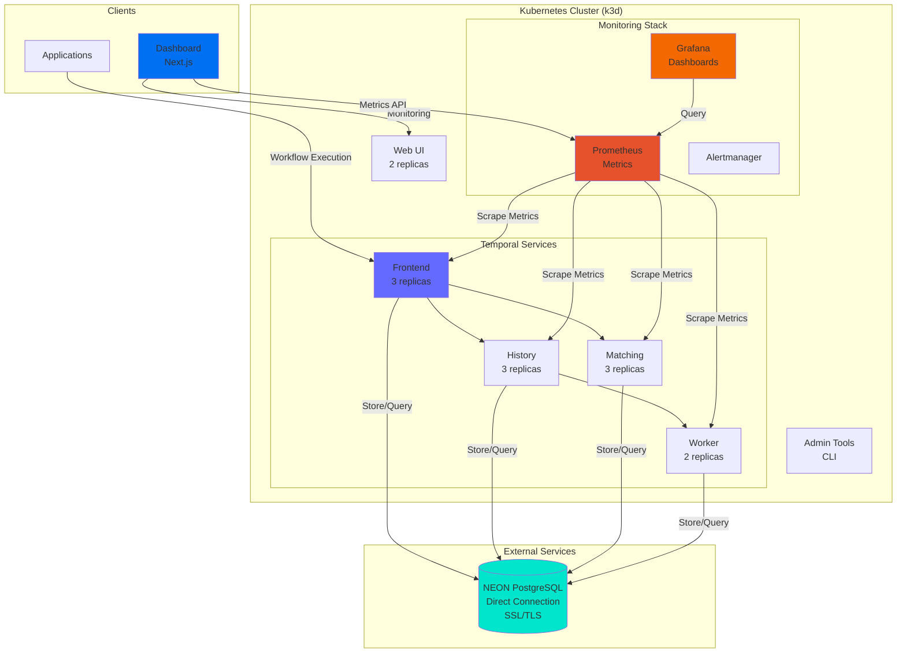
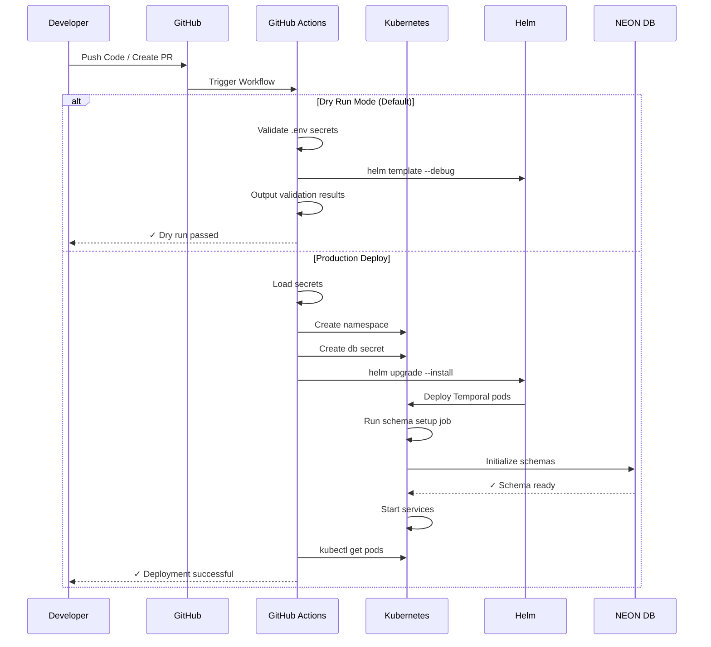
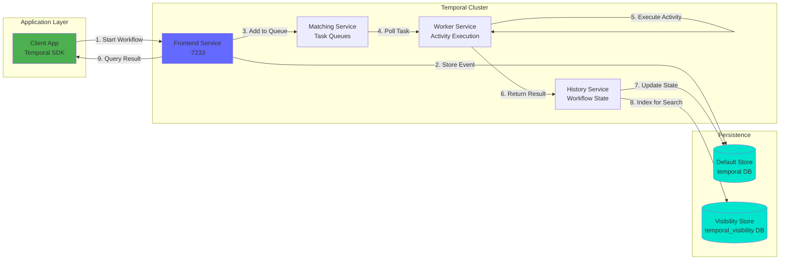

# Temporal Production Cluster Deployment

Production-ready Temporal cluster deployment on Kubernetes with NEON PostgreSQL backend.

## 📋 Overview

Resilient Temporal cluster (v0.73.1) deployment on Kubernetes with:
- **Database**: NEON PostgreSQL with SSL/TLS
- **High Availability**: Multi-replica deployment
- **Automation**: GitHub Actions CI/CD with Dry-Run validation

## 🏗️ Architecture



## 🔄 Deployment Flow



## 📊 Data Flow




## 📁 Project Structure

```
.
├── backend/                  # Infrastructure & DB Config
│   ├── temporal/             # Temporal Cluster Config
│   │   ├── temporal-values-neon.yaml  # Helm values
│   │   └── temporal-namespace.yaml    # K8s Namespace
│   └── database/             # Database Config
│       ├── temporal-db-secret.yaml    # Secret templates
│       └── *.sql                      # Sample schemas
├── frontend/                 # Client Applications (Placeholder)
└── ci-cd/                    # Deployment Scripts
    ├── Deploy-Temporal.ps1    # Manual deployment
    └── Verify-Temporal.ps1    # Cluster verification
```

## 🚀 Deployment

### Option 1: CI/CD (Recommended)

GitHub Actions workflow is configured in `.github/workflows/deploy-temporal.yml`.
Defaults to **Dry-Run** mode for safety.

To deploy to production:
1. Go to "Actions" tab
2. Select "Deploy Temporal to Kubernetes"
3. Click "Run workflow"
4. Set "Dry run mode" to `false`

### Option 2: Manual Deployment

```bash
cd ci-cd

# Dry Run (Validate Only)
./Deploy-Temporal.ps1 -DryRun

# Production Deploy
./Deploy-Temporal.ps1
```

## ⚙️ Configuration

- **Cluster Config**: `backend/temporal/temporal-values-neon.yaml`
- **Database Secrets**: `backend/database/temporal-db-secret.yaml`
- **Schemas**: See `backend/database/*.sql` for reference

## 📊 Monitoring

**Grafana Performance Dashboards** are enabled.

```bash
# Access Grafana Dashboard (User: admin)
# 1. Get Password
kubectl get secret -n temporal-prod temporal-grafana -o jsonpath="{.data.admin-password}" | base64 --decode ; echo

# 2. Port Forward
kubectl port-forward -n temporal-prod svc/temporal-grafana 3000:80

# 3. Open http://localhost:3000
```

## 📚 Documentation
- [Quick Start Guide](QUICKSTART.md)
- [Secret Setup](.github/SECRETS.md)
